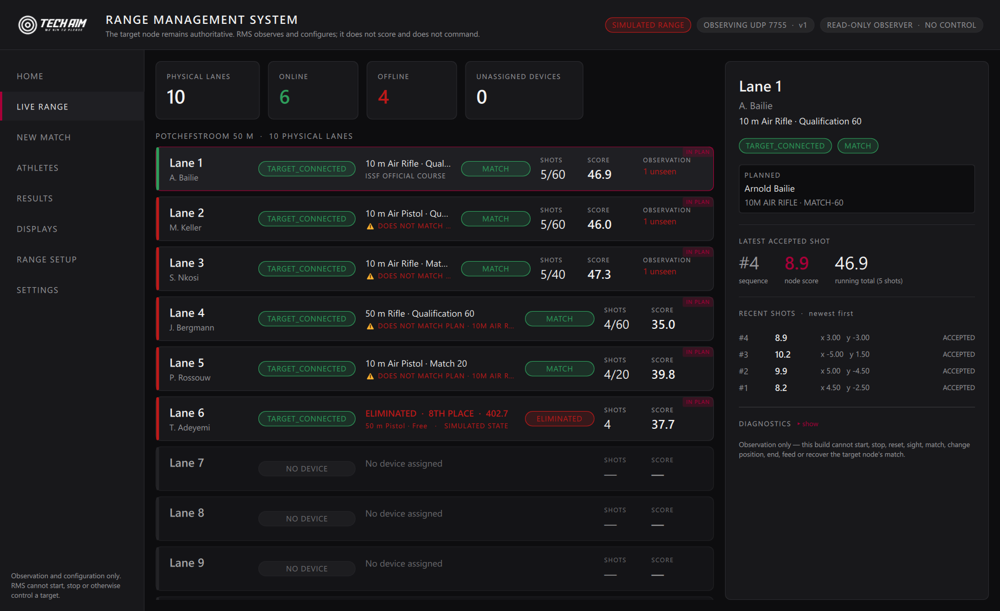
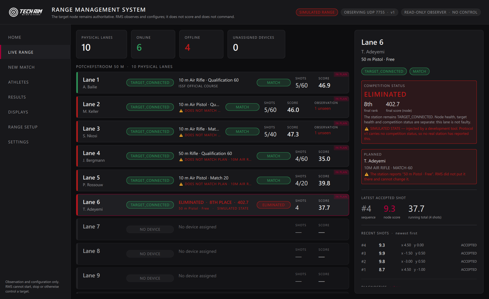

# 3P Finals — elimination display requirement

A **product requirement** for the display architecture, recorded so it is not
lost between milestones. Part of it is implemented now; most of it depends on a
protocol revision that has not happened.

---

## 1. The requirement

In an ISSF / Tech Aim 3P Final, when `Finals3PController` determines that an
athlete has been **eliminated / counted out**:

> **THE ATHLETE'S OWN DISPLAY MUST CLEARLY SHOW THAT THEY ARE ELIMINATED.**

Eventually on all four surfaces:

1. the athlete tablet
2. the RMS lane display
3. spectator / target displays
4. leaderboard and ranking presentation

An athlete who does not know they are out keeps shooting. That is the failure
this requirement exists to prevent, and it is a competition failure, not a
cosmetic one.

---

## 2. Authority — and the one rule that protects it

```
Finals3PController (target node)
        ↓   authoritative elimination state
    telemetry
        ↓
RMS  and  every display
```

**RMS MUST NEVER CALCULATE OR INFER ELIMINATION.** Specifically, never from:

| Tempting signal | Why it is wrong |
|---|---|
| rank alone | RMS holds no ranking, and building one to decide this would make RMS a scoring authority |
| score alone | a low total is not a rule |
| number of shots | finishing the course is not being counted out |
| number of athletes still active | the reason one lane went quiet may be a flat battery |
| translated text | QML-LANG-001 — a translated string in a logic path already cost this project a mis-scored session |
| another athlete disappearing | that is a network event, not a jury decision |

Every one of those is a plausible-looking heuristic that would eventually tell
an athlete they were out when they were not. Only the node knows the rule it
applied.

`tests/rms/tst_competition_state.cpp` exercises each of these against a live
range and asserts the competition status stays `UNKNOWN` after all of them.

---

## 3. Three separate statuses

An eliminated athlete's station is normally **completely healthy**. Collapsing
these into one "status" makes an eliminated finalist look like a network fault,
or a dead tablet look like an elimination.

| | |
|---|---|
| **NODE STATUS** | is the station reachable? `ONLINE` / `OFFLINE` |
| **TARGET STATUS** | is its target answering? `TARGET_CONNECTED` / `TARGET_DISCONNECTED` |
| **COMPETITION STATUS** | where is the athlete in the competition? `ACTIVE` / `WAITING` / `FINISHED` / `ELIMINATED` |

These are modelled separately today: `ConnectionState` (node/target) and
`CompetitionState` ([`src/rms/CompetitionState.h`](../../src/rms/CompetitionState.h))
are independent fields on `TargetNodeRecord`, and the lane surfaces show them
side by side.

---

## 4. What each surface must eventually show

### Athlete tablet — the target application, not RMS

A clear terminal competition state:

```
        3P FINAL

        ELIMINATED

        8TH PLACE

        FINAL SCORE
        402.7

        Competition complete
```

- unmistakable `ELIMINATED` (translated for presentation, never as a logic key)
- final rank and final score
- live-shooting emphasis removed — nothing that implies "keep firing"
- the target may remain visible or dimmed if useful
- **`Finals3PController` decides what controls remain available**
- **no second elimination calculation in QML** — the controller already knows

### RMS lane display — implemented now

```
LANE 6
T. Adeyemi

ELIMINATED · 8TH PLACE · 402.7
```

**The lane is not removed and the athlete is not hidden.** The station is still
online, its target still connected, and officials still have to account for the
athlete. Only what the lane *says* changes.

### Spectator display — not built

```
ATHLETE ELIMINATED

ARNOLD BAILIE
8TH PLACE
402.7
```

…then back to the remaining live finalists. The eliminated athlete **stays in
the official ranking** with an eliminated indicator.

### Leaderboard — not built

Eliminated athletes remain listed, marked, in their final position.

---

## 5. Display state model

```
CompetitionStatus   ACTIVE · WAITING · FINISHED · ELIMINATED   (+ UNKNOWN)

finals metadata     rank · finalScore · finalsStage · eliminatedAtStage
```

`FINISHED` and `ELIMINATED` are both **terminal** (`isTerminal()`), because a
display must stop inviting *either* athlete to shoot. Only `ELIMINATED` is an
elimination.

Every value carries its **source**: `NotReported`, `Telemetry`, or
`DevelopmentInjection`. An audit must always be able to tell a real elimination
from a demonstration one, and every surface labels an injected value
`SIMULATED`.

---

## 6. Protocol — a deliberate v2, never a widened v1

**These fields are NOT in protocol v1 and must not be added to it.** Protocol
evolution is deliberate: v1 rejects an unknown version rather than guessing, so
carrying competition status means a **version bump**, agreed with the node side.

Required of that revision, in `node.status`:

| Field | Meaning |
|---|---|
| `competitionStatus` | `ACTIVE` / `WAITING` / `FINISHED` / `ELIMINATED` — stable tokens, never translated |
| `rank` | final or current rank, as the node determined it |
| `finalScore` | the node's score. RMS formats it and never computes one |
| `finalsStage` | where the final was |
| `eliminatedAtStage` | where the athlete was counted out |

`competitionStatusFromString()` already exists so those tokens have one spelling
when the revision lands, and an unrecognised token resolves to `UNKNOWN` rather
than being guessed at.

**Until then, every real station reports `UNKNOWN` and RMS says so.** A test
asserts that a v1 datagram carrying a `competitionStatus` field cannot set one —
unknown fields are ignored, exactly as the versioning rule requires.

---

## 7. What was built for this now

- `CompetitionStatus` / `CompetitionState` as a **third independent axis**.
- The lane surfaces **handle terminal states**: the card shows the terminal
  result in place of the course, the phase pill shows the competition status
  instead of `MATCH` (saying `MATCH` there would invite the athlete to keep
  shooting), and the detail pane states in words that node health, target
  health and competition status are separate.
- The lane **stays on the range**, dimmed no more than any other healthy lane.
- A development-only injection (`--simulate-elimination <lane>:<rank>:<score>`)
  so the display can be *shown* handling a terminal state. It is deliberately
  **not** part of `ingestDatagram`: no datagram can produce it, which is what
  keeps "RMS never infers elimination" true.
- Tests for every inference RMS must not make.

## 8. What was NOT built, and is not claimed

- No change to the target-node protocol.
- No change to `Finals3PController`.
- **No real elimination telemetry exists.** Nothing in this build has ever
  received an elimination from a station, and every displayed one is labelled
  `SIMULATED`.
- No athlete-tablet presentation (that is the target application's work).
- No spectator display or leaderboard.

### Evidence

Real captures of `TechAimRMS.exe` with an injected terminal state.

**The lane.** `ELIMINATED · 8TH PLACE · 402.7`, with `TARGET_CONNECTED` still
green beside it and the lane still on the range.



**The detail.** Competition status, final rank, the node's final score, the
statement that the station is not faulty, and the `SIMULATED STATE` warning.


