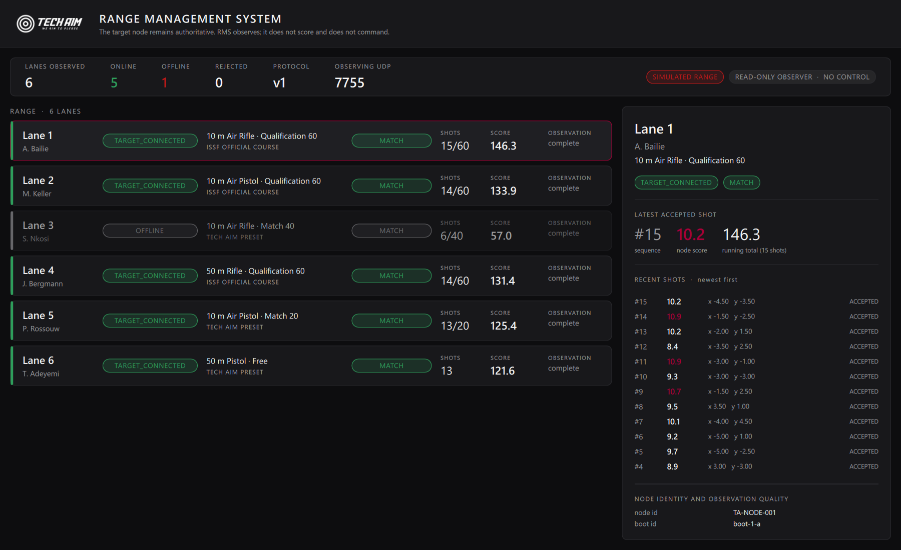
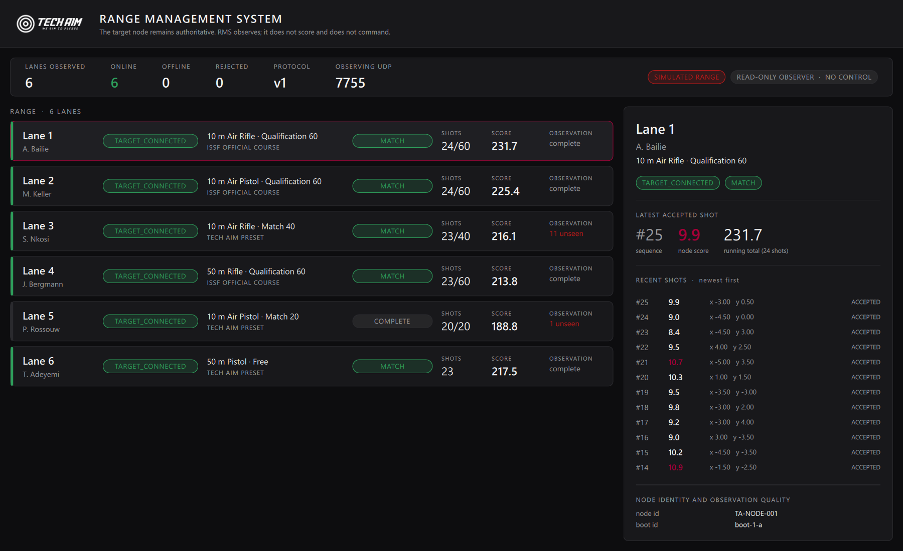

# Tech Aim RMS — milestone 1: the read-only range observer

Product line: **Tech Aim Range Management System**. Branch `feature/rms`.
This document covers the first RMS milestone only. There is **no central match
control in this milestone and none in this build**.

## 0. The invariant everything else serves

**THE TARGET NODE REMAINS AUTHORITATIVE.**

The individual Tech Aim target station owns its physical target connection,
shot acquisition, sequence integrity, scoring, SessionStore, recovery, paper
feed and local match state. RMS observes.

If RMS crashes, is closed, is unplugged or was never started, **the target
match continues unchanged**, because nothing in RMS is part of the node's
control loop. Milestone 1 makes that structurally true rather than merely
intended: there is no command message in the protocol, no transmitting socket
in the observer, and no method on any RMS class that acts on a node. Section 8
describes how that is enforced and tested.

---

## 1. Networking audit — what already existed

Before designing anything, the existing network code was read in full.

| File | What it actually is | Verdict |
|---|---|---|
| `sender.cpp` / `sender.h` | The Qt "Broadcast Sender" **example**, BSD-licensed, unmodified apart from one added `broadcastDatagram(QString)`. A `QWidget` that owns a `QUdpSocket` and broadcasts to **port 7755**. | Transport idea reusable; the class is not |
| `receiverTachus.cpp` / `.h` | The Qt "Broadcast Receiver" **example**. Binds **port 7756** with `ShareAddress`, splits datagrams on the literal `&*&`, and drives `TachusWidget`. | Not reusable — see below |
| `ModReader/forms/tachuswidget.cpp:1640` | Lane announce. Payload: `laneName-… &*& systemName-… &*& ip-… &*& mac-… &*& netmask-… &*& gamemode-N`. Constructs a **stack-local `Sender`** per broadcast. | Confirms a node→range path exists today |
| `ModReader/forms/tachuswidget.cpp:1998` | Shot broadcast. Payload: `shootdata <lane> <count> <x> <y> <score> <isSighter>` — space-delimited, gated on `getIsServerNetworkEnabled()`. | Confirms accepted-shot telemetry exists today |
| `TachusWidget::startTCP()` | Creates a `QTcpServer` and does nothing else. | Dead stub |
| `receiverTachus.cpp` → `startMatchFromServer()`, `matchDetails(...)` | The **inbound control path**: a "TCMA" master can start a match on the lane. Also reachable from `appsettings.cpp:723` via a settings file. | **The exact capability milestone 1 must not exercise** |
| `.pro` files | No `QT += network` anywhere. `QUdpSocket` compiles only because Qt 6's `QtQml` links `QtNetwork` transitively. | Fragile; RMS declares `network` explicitly |

### What was reused, and what was not

**Reused: the transport decision and the port allocation.** UDP datagrams on
**7755** for node→range telemetry is what the range already does. RMS binds
7755 with `ShareAddress`, so a target application on the same machine keeps
working — RMS is one more listener, never an owner of the port. No second
networking stack was introduced, no broker, no WebSocket, no new dependency.

**Not reused: the message format and both example classes.** Concretely:

1. `shootdata 1 17 -1.25 2.5 10.4 0` has **no version field**, so it can never
   be changed compatibly; **no event id**, so a duplicate is undetectable; **no
   session id**, so a shot cannot be tied to a match; and **no stable node
   identity** — it uses the lane name, which is an assignment, not an identity.
2. `ReceiverTachus` is a `QWidget` whose whole purpose is to apply inbound
   commands to a target. Reusing it in RMS would import the control path this
   milestone exists to exclude.
3. `Sender` is constructed on the stack per datagram, creating and destroying a
   socket per message. Even if RMS needed to transmit — it does not — that is
   not the class to do it with.

The legacy `&*&` format is left completely untouched. RMS adds a new, versioned
message set on the same port; a v1 decoder rejects anything it does not
understand and counts the rejection, so legacy traffic on 7755 is inert rather
than dangerous.

### EventBus / EventRegistry

`src/reliability/events/` was surveyed as the natural seam for publishing the
accepted-shot event **from the node side**. It is untouched in this milestone:
milestone 1 delivers the RMS-side consumer and proves the event path, and
wiring the node's publisher into the reliability event registry is milestone 2
work on the shared foundation. Nothing here required rewriting it.

---

## 2. Protocol v1 — node → range only

JSON, one object per UDP datagram, on port **7755**. `protocolVersion` is
mandatory and first. Full definition: [`src/rms/RmsProtocol.h`](../../src/rms/RmsProtocol.h).

Three message types. **There is no fourth.**

### `node.announce` — identity

```
protocolVersion  nodeId  bootId  laneId  deviceIdentity
appVersion  productIdentity  timestampUtcMs
```

### `node.status` — heartbeat, ~2 s

```
protocolVersion  nodeId  bootId  laneId  sessionId
programmeId  rulesetId  targetStandardId  athleteName  position
connection  phase  shotsAccepted  shotsExpected  totalScore
health  statusSeq  timestampUtcMs
```

### `shot.accepted` — one authoritative accepted shot

```
protocolVersion  eventId  nodeId  bootId  laneId  sessionId
programmeId  position  shotSequence  rawXMm  rawYMm
authoritativeScore  integerScore  innerTen
timestampUtcMs  acquisitionStatus
```

**`authoritativeScore` is transported, never recomputed.** `rawXMm` / `rawYMm`
travel for display and diagnostics only. RMS contains no ring geometry, no
projectile diameter and no scoring formula; `CenterPane.qml::calculateShootingSocre()`
and `AppSettings` remain the only scoring authority in the product family.

### Node identity

| Field | Meaning | Why not something else |
|---|---|---|
| `nodeId` | Stable, persisted identity | **Not the COM port** — that changes on reconnect. Not the IP, not the MAC, not the lane name |
| `bootId` | New on every node process start | Distinguishes *"the node restarted"* from *"the network blinked"* — two situations that need opposite handling |
| `laneId` | Current assignment, may be empty | An assignment, not an identity; it changes without the node changing |
| `deviceIdentity` | Target hardware fingerprint | The device can be swapped under a node |

### State model

`connection` and `phase` are **orthogonal**, because a node can be
`TARGET_DISCONNECTED` while its match phase is still `MATCH`.

- `connection`: `ONLINE` · `TARGET_CONNECTED` · `TARGET_DISCONNECTED` ·
  `RECONNECTING` · `OFFLINE`
- `phase`: `IDLE` · `PREPARATION` · `SIGHTING` · `MATCH` · `POSITION_CHANGE` ·
  `COMPLETE` · `RECOVERY_REQUIRED`

**`OFFLINE` is deliberately not decodable.** It is a conclusion RMS draws from
heartbeat silence. A node claiming to be offline is a contradiction, and
accepting it would let one stale datagram park a live lane in the wrong state.

### Versioning rules

- Unknown **fields** are ignored — forward compatible.
- An unknown **version** is rejected with a reason, never guessed.
- An unknown **type** is rejected. `command.startMatch` decodes to nothing,
  because protocol v1 has no command grammar at all.
- Rejections are counted and surfaced on the dashboard, not swallowed.

### Programme identity

RMS carries `programmeId`, `rulesetId` and `targetStandardId` from
`CompetitionCatalogue.qml` verbatim. Display text is **derived from** the
stable id by `ProgrammeDisplay::describe()` — a pure function, deliberately not
a second copy of the catalogue, since a duplicate description drifts. The
direction is one-way: **nothing is ever looked up by display text** (QML-LANG-001).

`rulesetId` alone decides whether a programme is an official competition
course. `techaim.10m.air-rifle.match40` shoots on an ISSF target under ISSF
scoring and is still **not** an ISSF event; the dashboard labels it
`TECH AIM PRESET`, and `issf.*` programmes `ISSF OFFICIAL COURSE`.

---

## 3. Components created

### Observer core — `src/rms/` (QtCore + QtNetwork, no GUI)

| File | Responsibility |
|---|---|
| `RmsProtocol.h/.cpp` | Message structs, enum tokens, encode/decode, version gating |
| `TargetNodeRecord.h/.cpp` | One node's observed state + `ShotLedger` (dedup, ordering, gaps) |
| `RangeMonitor.h/.cpp` | The observer. **One ingress (`ingestDatagram`), no egress.** Liveness/offline |
| `RangeListModel.h/.cpp` | `QAbstractListModel` projection for QML; also renders a text dashboard |
| `ProgrammeDisplay.h/.cpp` | `programmeId` → readable label; official-vs-preset |
| `RmsUdpObserver.h/.cpp` | Receive-only UDP endpoint; private socket, bind + read only |
| `dev/SimulatedRange.h/.cpp` | **Development only** — a fake range (section 6) |

### Application — `rms/`

`TechAimRMS.pro` (a **separate binary**: no `Seta.pro`, no `ModReader`, no
serial/Modbus — RMS never talks to target hardware), `main.cpp`, `rms.qrc`,
and `qml/RmsMain.qml`, `RmsSummaryBar.qml`, `RmsLaneCard.qml`,
`RmsLaneDetail.qml`, `RmsStatusPill.qml`. (`RmsSummaryBar.qml` was never
instantiated once the navigation shell landed in Milestone 3, and was removed
in Milestone 4.5.)

Branding is Tech Aim only: the shared `Theme.qml` and `src/ui/theme/*` are
reused **unmodified** from the foundation, plus the Tech Aim wordmark. No SETA
asset, no DSB selector, no customer-specific product identity.

### Tests — `tests/rms/`

`rms_tests.pro` (`QT = core network` — compiling at all proves the observer,
its model and its protocol carry no QML/GUI dependency, and the harness needs
no platform plugin), `main.cpp`, `test_support.*`, `tst_protocol.cpp`,
`tst_monitor.cpp`, `tst_simulator.cpp`, `tst_udp.cpp`, `tst_readonly.cpp`.

Time is **injected** into every entry point, so offline detection, reconnection
and restart are asserted deterministically with no sleeps.

---

## 4. Duplicate and ordering behaviour

Keyed per node, per session.

| Situation | Behaviour |
|---|---|
| Same `eventId` twice | Suppressed. Displayed **once**. Counted in `duplicatesSuppressed` |
| Same `shotSequence`, **different** `eventId` | Suppressed **and flagged** as `sequenceConflicts`. The **first** observation wins — overwriting an accepted shot on the strength of a second datagram is how a display starts disagreeing with the target |
| #18 arrives before #17 | Both held, stored **by sequence**. The display order is sequence order, never arrival order |
| #17 never arrives | Reported as a **gap**, listed by number. Not silently closed |
| A late lower sequence | Accepted, counted in `outOfOrder`. Does **not** pull the high-water mark back |
| New `sessionId` | Ledger re-bases. The old session was finished, not wrong. Lifetime quality counters survive |
| Node restart (new `bootId`) | Same node, same lane. `statusSeq` resets, because it is monotonic **per boot** — a restart must not look stale |
| Lower/equal `statusSeq` in one boot | Dropped as stale, counted. A late heartbeat cannot drag a lane backwards |
| A datagram from a **superseded** `bootId` | Dropped and counted as `staleBootDropped`. Datagrams do not stop in flight when an application restarts; treating a straggler as a restart would tick the restart counter twice **and** reset the stale-status guard, letting the old run's heartbeats overwrite the new run's state |

---

## 5. Offline, reconnect and RMS restart

**Offline** is silence for longer than three heartbeats (6 s default). RMS
marks the lane `OFFLINE`, **keeps it on the range**, and **retains everything
it observed**. Nothing is sent and nothing on the node is changed.

**Return.** RMS reconciles from the node's own authoritative state. The node
kept shooting while RMS could not see it, so `shotsAcceptedByNode` has moved
on. RMS then reports the difference explicitly:

```
shotsAcceptedByNode   what the NODE says it accepted   — authoritative, shown
ledger.observedCount  what RMS actually received
unobservedShotCount   the difference, shown as "N unseen"
```

**RMS restart** is the same problem at full scale. A fresh RMS process knows
nothing and rebuilds purely from what the nodes broadcast next. It cannot
recover shots it never saw, so it says so: after restarting mid-match against a
node on shot 41, the dashboard shows the node's **41**, holds the **1** shot it
has observed, and declares **40 unobserved**.

That distinction is the whole design of the dashboard. A management overview
that quietly under-reports a live match is worse than one that admits a gap.

---

## 6. Development simulator

`src/rms/dev/SimulatedRange` — compiled only under `TECHAIM_RMS_DEV_SIMULATOR`,
confined to `src/rms/dev/`, and the only place in the RMS tree that plays the
node's role.

It cannot contaminate production target logic: it lives in the RMS product
tree, imports nothing from the target application's acquisition, scoring or
SessionStore code, and emits datagrams into the same read-only
`RangeMonitor::ingestDatagram` the network uses. The application prints a
standing banner whenever it is active and the dashboard shows a
`SIMULATED RANGE` badge, so a simulated range cannot be mistaken for a real one.

Deterministic by construction — virtual time is advanced explicitly and the
number sequence is a seeded LCG (no wall clock, no `QRandomGenerator`), so the
harness asserts exact counts with no sleeps.

Scripted scenario, six lanes:

| t | Event |
|---|---|
| 0 s | All nodes announce; `PREPARATION` → `SIGHTING` → `MATCH` |
| 3 s+ | Accepted shots, staggered per lane |
| — | Every lane re-sends shot **#3** once (duplicate) and holds **#5** back until after **#6** (reorder) |
| 14–34 s | **Lane 3** goes silent. Its node **keeps shooting** — only the broadcast is lost |
| 26 s | **Lane 5**'s application restarts and returns with a new `bootId` |
| 34 s+ | Lane 3 returns; RMS reconciles and reports the shots it missed |

**No physical firing is used for this milestone.**

---

## 7. The dashboard

A table/card hybrid sized for 6–20 lanes: `Lane · Athlete · Target · Programme ·
Phase · Shots · Score · Observation`, with a live detail pane for the selected
lane (latest accepted shot, running total, recent shots newest-first, node
identity and observation quality). It is a management overview — no target
face, no ring geometry, no second shooting UI.

Every value is the node's value. `scoreLabel` **formats** `totalScore`; it does
not compute it.

### Evidence — real application screenshots

Captured from `TechAimRMS.exe` against the simulated range via the
`TECHAIM_RMS_CAPTURE` development hook (a genuine `QQuickWindow::grabWindow`
of the running application, not a mockup).

**Lane 3 offline, virtual t ≈ 24 s.** Five lanes live, Lane 3 silent and shown
`OFFLINE` with its observed history retained. Rejected datagrams: 0.



**After reconnection, virtual t ≈ 39 s.** Lane 3 is back `TARGET_CONNECTED` on
23/40, and RMS declares **12 unseen** — the shots the node accepted while RMS
could not see it. Lane 5 restarted and completed its 20-shot programme, showing
**1 unseen** across the restart. Every other lane reads `complete`.



---

## 8. The read-only boundary

For this milestone RMS **must not** send Start, Stop, Reset, Sighting, Match,
Position Change, End, Feed or any recovery command. Read-only means read-only.

Enforced by four independent mechanisms, each catching what the others cannot:

1. **The protocol has no command grammar.** There is no command struct, no
   command encoder and no command type token. `command.startMatch` is rejected
   as an unknown type.
2. **The observer has no egress.** `RangeMonitor` owns no socket and has one
   ingress. `RmsUdpObserver` keeps its socket private, only ever calls `bind`
   and `readDatagram`, and discards the sender address — keeping a destination
   around would only invite a reply path.
3. **A source scan** (`tst_readonly.cpp`) fails the build's tests if any
   authored file under `src/rms/` (excluding `dev/`) or `rms/` contains a
   transmit call, opens a TCP connection, or references the node's inbound
   control port `7756`. The one legitimate mention is the constant's
   declaration in `RmsProtocol.h`, which exists so the port can be named and
   asserted unused.
4. **A meta-object and model scan** — no `Q_INVOKABLE` reachable from QML
   returns `void` (everything QML can call reports rather than acts), no
   command-shaped method name exists on any RMS class, and the dashboard model
   refuses `setData` and exposes no editable row.

The boundary is also stated on screen: `READ-ONLY OBSERVER · NO CONTROL` in the
summary bar, and a restatement in the detail pane where an operator would look
for a control and find none.

---

## 9. Future control interface — DESIGN ONLY, NOT IMPLEMENTED

Recorded so the read-only decision is legible, and deliberately **not built**.

A future command would carry `commandId · nodeId · sessionId · commandType ·
expectedState`, over an acknowledged connection (one TCP connection per node,
not UDP), with:

- **Idempotency** — re-delivery of the same `commandId` is a no-op.
- **Acknowledgement of applied state** — the node acks with the state it is now
  in, not merely "received".
- **`expectedState` as a precondition** — a command that assumes a phase the
  node has already left is refused, not applied.
- **Node veto** — the node may always refuse. It remains the authority on
  whether its own match may be altered.

None of this exists in the code. Adding it is a new milestone with its own
review; the guards in section 8 will fail the moment it is added by accident.

---

## 10. Scope discipline

Not done, deliberately: no repository restructure, no library extraction, no
EventBus rewrite, no scoring change, no SessionStore change, no database, no
cloud, no internet requirement, no command/control, no TV leaderboard, and no
change to SETA, to the protected Tech Aim foundation, or to the frozen RC3a
artefacts.

## 11. Next RMS milestone

**Publish the accepted-shot event from the node**, through the existing
`EventRegistry` in `src/reliability/events/`, so a real Tech Aim target station
emits protocol v1 telemetry and RMS observes real lanes instead of simulated
ones. That is the smallest next step that removes the simulator from the
critical path, and it must land on the shared foundation — not on `feature/rms` —
because it changes the node.

Only after the event path is proven against real hardware should the
acknowledged command channel of section 9 be considered.
