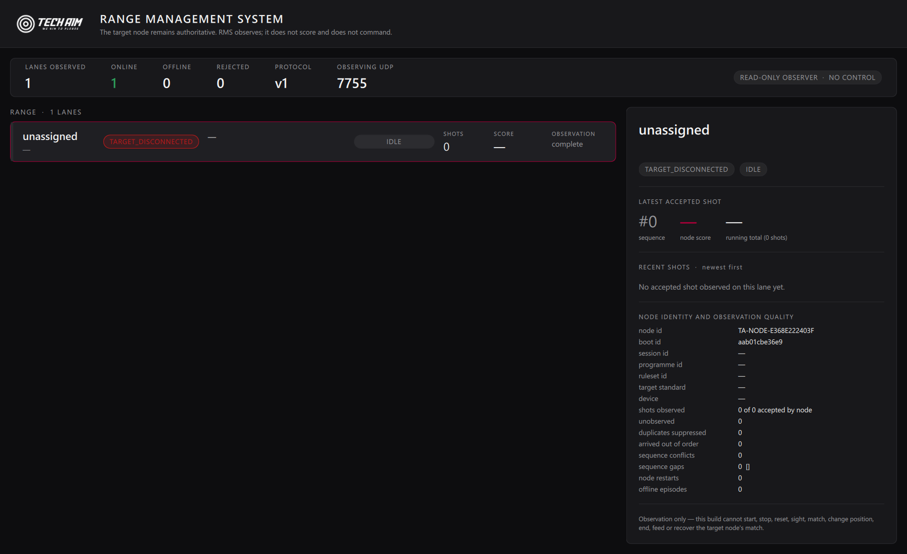
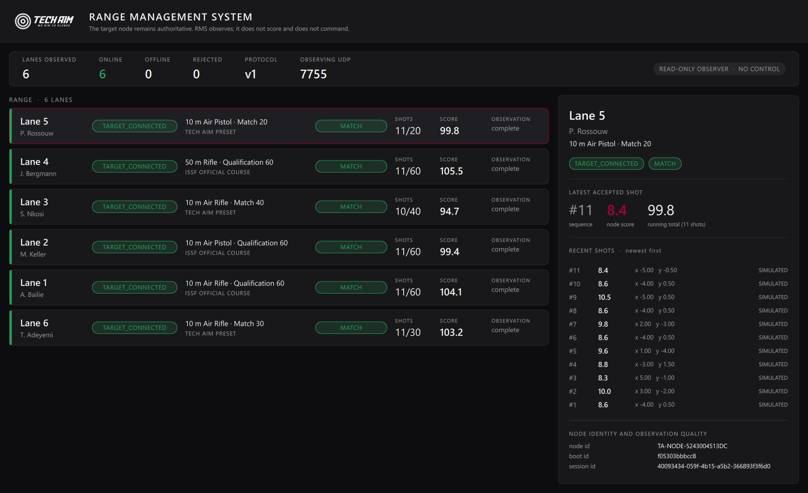
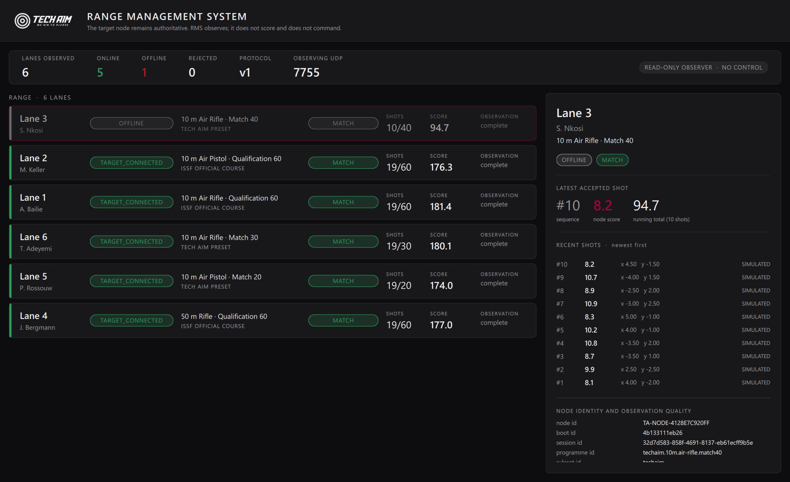
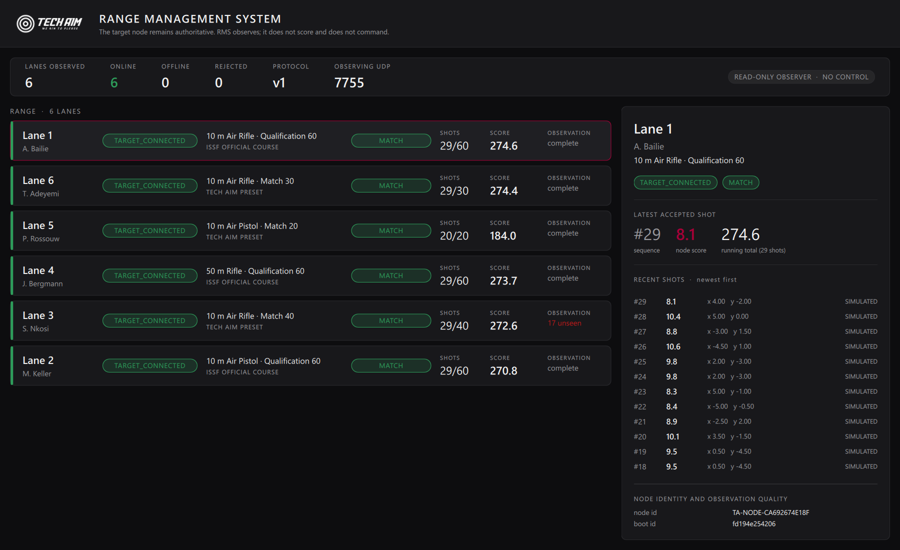

# Tech Aim RMS — milestone 2: real node telemetry

The target-node application publishes RMS protocol-v1 telemetry. The RMS
simulator stops being the only source of truth for the range view.

**This milestone changes the TARGET NODE / shared foundation.** Branch
`feature/rms-node-telemetry`, cut from foundation `f4058fa`
(`feature/rc2e-latency-and-reset`) — deliberately **not** from `feature/rms`.

Nothing here changes scoring, competition rules, target acquisition, SETA's
DSB behaviour or the frozen RC3a release.

---

## 0. The invariant, restated

**THE TARGET NODE REMAINS AUTHORITATIVE.** It owns the target connection, the
accepted shot, the coordinates, the score, the position, the phase, the local
competition controller, persistence, recovery and paper feed. This milestone
adds a *description* of that record on the wire. It adds no decision.

**If RMS is absent, the node behaves exactly as before.** Not "mostly" — the
publisher cannot return a value into the shot path, cannot block it, and
cannot fail it. §5 shows how that is structural rather than careful.

---

## 1. The shared protocol contract

`src/rms/RmsProtocol.h` / `.cpp` — promoted **byte-identical** from the RMS
milestone-1 implementation (`feature/rms`, `879cd84`), with only its header
comment extended to describe the second role it now serves.

It is the ONE description of the wire format, and it lives on the foundation
so both ends compile the same bytes from the same source:

| | |
|---|---|
| the target node | **encodes** — `src/telemetry/NodeTelemetryService` |
| the RMS observer | **decodes** — `src/rms/RangeMonitor` (RMS product only) |

A second hand-maintained copy on either side would drift, and a protocol that
drifts silently reports the wrong score on the wrong lane. **Nothing else from
`src/rms/` is shared:** the node compiles this file only and never links the
observer, its model or its UI. `Telemetry.pri` is what enforces that — it names
the files, and it names no others.

---

## 2. The accepted-shot seam

**`ta::rel::SessionStore::eventApplied(const DomainEvent&, bool replayed)`.**

That is the single point at which an event has been validated, accepted by the
reducer and applied to the authoritative state. Subscribing there makes it
*structurally impossible* to publish anything else:

| Cannot be published | Why not |
|---|---|
| raw Modbus coordinate reads | never reach a SessionStore |
| candidate shots | not submitted until classified and scored |
| rejected shots | `submit()` returns `!ok`; nothing is applied, nothing is emitted |
| UI click events | not events in this model at all |
| duplicate acquisition callbacks | the reducer rejects the duplicate; and the publisher additionally guards on `(sessionId, shotNumber)` |

`replayed == true` events are skipped. A recovery replay is history being
rebuilt, not a shot being fired, and protocol v1 has no message meaning "this
already happened". Publishing them would misreport when the shots occurred.

Three competition stores are attached in `main.cpp`: `QUAL`, `FINALS3P`,
`FINALS10M` — the same set the EST incident service consults.

**Training Lab sessions are deliberately not published.** They are a private
athlete tool, not a range competition; their `programId` is not a competition
programme, and putting one on a range dashboard would describe a lane with an
identity the competition catalogue does not define. Such a station reports
`IDLE` with its target state intact, which is the truthful description.

---

## 3. Identity

| Field | Source | Rule |
|---|---|---|
| `nodeId` | minted once, persisted at `rms/nodeId` in the application's own settings | survives restart, re-cabling, a new COM port, a new IP, a lane re-assignment and a different athlete |
| `bootId` | fresh per process, **never persisted** | how RMS tells a node restart from a network interruption |
| `deviceIdentity` | `TachusWidget::targetDevice()` | the hardware fingerprint — the device can be swapped under a station |
| `laneId` | provisional display only (§9) | an assignment, not an identity |

`nodeId` is `TA-NODE-` + 12 uppercase hex. It is never a MAC address, never
`COM7`, never `192.168.x.x` and never `"Lane 4"` — every one of those changes
while the station stays the same station.

---

## 4. What each message carries

Only fields the v1 contract defines. Three deliberate omissions, each named
rather than faked:

**`node.announce`** — `protocolVersion · nodeId · bootId · laneId ·
deviceIdentity · appVersion · productIdentity · timestampUtcMs`. Sent on
startup and every 30 s for rediscovery.

> The milestone brief lists `eventId` on the announce. **v1 has no such field**,
> and announce is not deduplicated by RMS — `node.status` carries `statusSeq`
> for ordering instead. Adding a field the observer does not read would be a
> private dialect, so the contract wins.

**`node.status`** — heartbeat every 2 s (RMS times a node out after three),
plus an immediate publish on every phase change, accepted shot, target
connect/disconnect and programme change, so a range display never lags a start
or a finish by a heartbeat. Carries `sessionId · programmeId · rulesetId ·
targetStandardId · athleteName · connection · phase · shotsAccepted ·
shotsExpected · totalScore · health · statusSeq`.

`shotsAccepted` is `state.officials.size()` and `totalScore` is
`state.totalTenths / 10` — both reducer-owned, both authoritative.

**OFFLINE is never sent.** It is RMS's conclusion from silence; a node claiming
it would be a contradiction. `TARGET_CONNECTED` vs `TARGET_DISCONNECTED` is the
real distinction a node can make, driven from the existing
`targetStatusChanged` signal — never inferred from datagram arrival, because a
node can be perfectly reachable with its target unplugged.

**`shot.accepted`** — the node's own record, transported:

| Wire field | From |
|---|---|
| `shotSequence` | `ShotCore::shotNumber` — the accepted competition sequence. Not a packet count, not a model row, not a visual tally |
| `authoritativeScore` | `scoreTenths / 10` — **the node's accepted score**. RMS never recalculates it |
| `integerScore` | `scoreTenths / 10` (integer) — the integer ring value |
| `rawXMm` / `rawYMm` | `xHundredthMm / 100` — diagnostics and display only |
| `sessionId`, `programmeId` | the store's state, and the catalogue selection |
| `acquisitionStatus` | `ACCEPTED`, or `SIMULATED` when the shot's own `simulated` flag is set |

### The three honest omissions

1. **`innerTen` is always `false`.** The accepted-shot record carries no
   inner-ten flag. Inner ten is a ring-geometry fact; deriving it from a score
   threshold in the transport would be scoring invented by the wire, visible to
   RMS as if the node had said it. `false` means *not reported*.
2. **`position` is always empty.** The only per-position identity the reducer
   holds is an integer index, and its meaning differs between rule authorities —
   the ISSF and DSB three-position orders are not the same (the risk recorded in
   `three-product-architecture.md` §11.5). Labelling a lane with the wrong
   position is worse than labelling it with none. No 3P programme exists in the
   catalogue today, so nothing is lost yet.
3. **Sighters are not published.** `SighterAccepted` carries `shotNumber == 0`
   by construction, v1 requires a positive competition sequence, and v1 has no
   field that classifies a shot as a sighter. Synthesising a sequence would put
   sighters into RMS's *match* ledger — precisely what the classification
   exists to prevent. The node's own sighter record is unchanged.

All three want the same fix: **a v2 message revision** adding `shotClass`,
`innerTen` as a reported flag, and a position identity resolved against a
named rule authority. None of them may be faked in v1.

---

## 5. Telemetry cannot touch a shot

The `eventApplied` slot runs inside the shot's own call stack. It therefore
does exactly two things: format bytes, and append them to a bounded outbox.

- **No socket call there.** Sending happens on a 25 ms timer, off that stack.
- **No return value the acquisition path can act on.** The slot returns `void`
  and the store ignores it.
- **No unbounded queue.** The outbox holds 256 datagrams; on overflow the
  **oldest** is dropped and counted. Telemetry is a live view, not an archive —
  the newest observation is the one worth keeping, and RMS reconciles any gap
  from the authoritative counts in the next status. An unbounded queue would
  trade a display gap for a memory leak during a match.
- **No synchronous retry.** A failed send is counted and the datagram is
  dropped. There is no ACK to wait for, because v1 has none.
- **No sink is a valid configuration.** A publisher with a null sink accepts
  every event and sends nothing.

Asserted directly: a shot is accepted, durably journalled and present in the
authoritative record with (a) no sink at all, (b) every send failing, and
(c) an unroutable destination address.

---

## 6. Transport

UDP to **7755**, the port the range already uses for node→range traffic
(`sender.cpp` broadcasts there today). `UdpTelemetrySink` **never binds**: a
socket that only writes cannot deliver an inbound command. The node's legacy
inbound port **7756 is not touched**, and the harness asserts it stays silent
while the node publishes.

No TCP, no ACK protocol, no RMS→node grammar. Milestone 1's read-only guards on
the RMS side remain in force; this milestone adds nothing they would catch.

---

## 7. Legacy telemetry is unchanged

The existing `&*&` lane announce and `shootdata …` broadcast in
`ModReader/forms/tachuswidget.cpp` are **untouched**, still gated on
`getIsServerNetworkEnabled()`, still on their existing ports. Systems that
depend on them keep working.

The two paths are separate and stay separate during migration:

| | LEGACY | RMS V1 |
|---|---|---|
| Format | `&*&` / space-delimited | JSON, versioned |
| Identity | lane name | `nodeId` + `bootId` |
| Dedup | none | `eventId` |
| Source | `TachusWidget` acquisition | `SessionStore::eventApplied` |
| Status | frozen, additive only | the path forward |

A legacy packet is **never** re-dressed as a v1 message. It does not carry a
sessionId, a programmeId, a stable node identity or an event id, and pretending
otherwise would put invented values into a competition record.

---

## 8. Restart behaviour

**RMS restarts.** The node neither knows nor cares. Its next `node.status`
carries the authoritative `shotsAccepted` and `totalScore`, and RMS milestone 1
already displays the difference between that count and what it observed as
*unseen*. No historical replay is attempted, because v1 has no message for it.

**The node restarts.** Same `nodeId`, new `bootId`, `statusSeq` back to 1.
RMS milestone 1 already treats that as one restart of the same station rather
than a new lane, and already drops datagrams from a superseded boot so a late
one cannot overwrite current-boot state.

---

## 8a. Evidence

Real `grabWindow` captures of `TechAimRMS.exe --live` observing real
publishers. No simulator is running in any of them — the `SIMULATED RANGE`
badge is absent, which is itself part of the evidence.

**The real application.** `TechAim.exe` launched with no session and no target
attached. It announces, and RMS shows the station: node id, boot id,
`TARGET_DISCONNECTED` (truthful — there is no target on this machine) and
`IDLE` (no session open). Nothing was clicked; startup telemetry alone
produced this.



**Six stations under match.** `tools/rmsnode` driving six real
`QualificationController` + `SessionStore` + publisher stacks. Real programme
identities, real accepted counts, node-computed scores, real session ids, and
`SIMULATED` acquisition status — correct, because these are demo-mode shots.



**A station goes quiet.** Lane 3's telemetry stops while its match keeps
running. RMS marks it `OFFLINE`, keeps it on the range and retains what it
observed.



**And comes back.** Lane 3 returns at 29/40 with **17 unseen** — the shots its
node accepted while RMS could not see it. RMS reconciled from the node's
authoritative count, exactly as §8 requires, with no replay and no invented
history.



Harness summary for that run, printed by the node tool:

```
node 1  accepted=30  published=30  announces=3  status=72  dropped=0  sendFail=0
node 3  accepted=30  published=13  announces=3  status=45  dropped=0  sendFail=0   <- blackout
node 5  accepted=20  published=0   announces=2  status=25  dropped=0  sendFail=0   <- restarted
```

Node 3 accepted 30 and published 13: **the match continued through the
blackout**, which is the whole point. Node 5's counters read 0 published
because the counters belong to its *new* boot — its pre-restart shots were
published by the process that no longer exists, which is precisely what a
restart means.

## 9. Not in this milestone

- **No range/lane definition.** `laneId` is provisional display text only; the
  permanent `nodeId ↔ laneId` mapping is milestone 3.
- **No spectator/TV display.** The contract nevertheless already carries
  authoritative score, raw x/y, session and athlete identity, phase and
  programme, so a display client can be built on it without a protocol change.
- **No commands, in either direction.**

---

## 10. Next milestone

**Range definition, lane configuration and automatic node assignment** — RMS
holds the range's lane list, binds each `nodeId` to a `laneId`, and stops
depending on whatever lane name a station happens to have been told locally.
