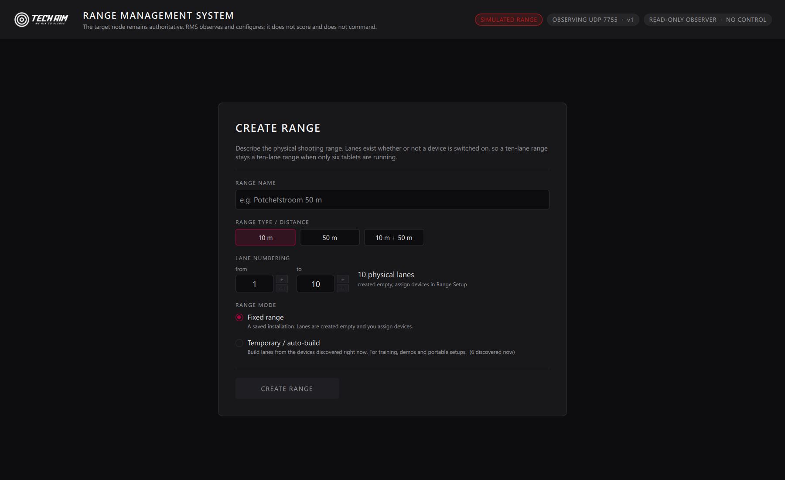
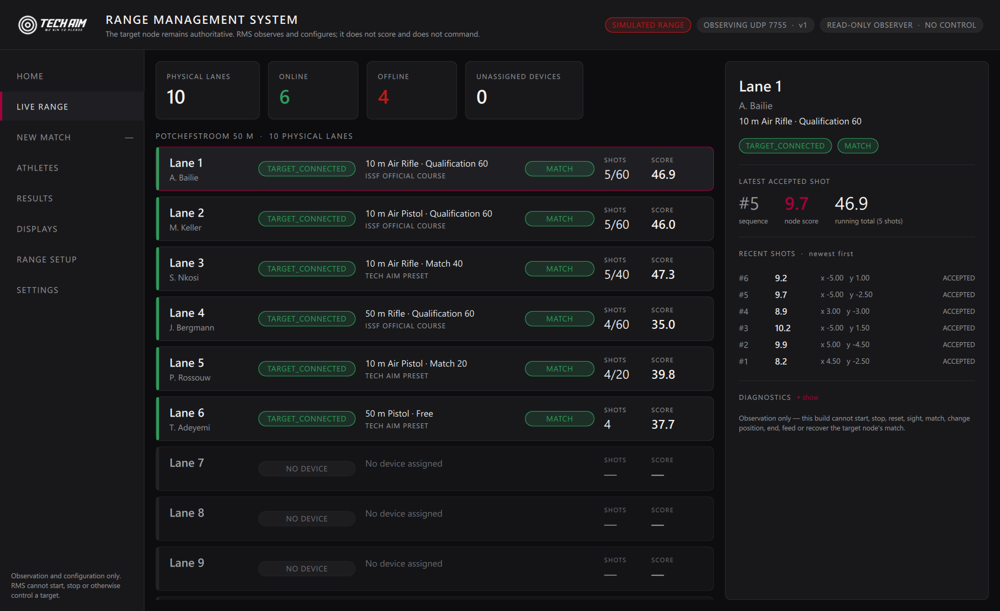
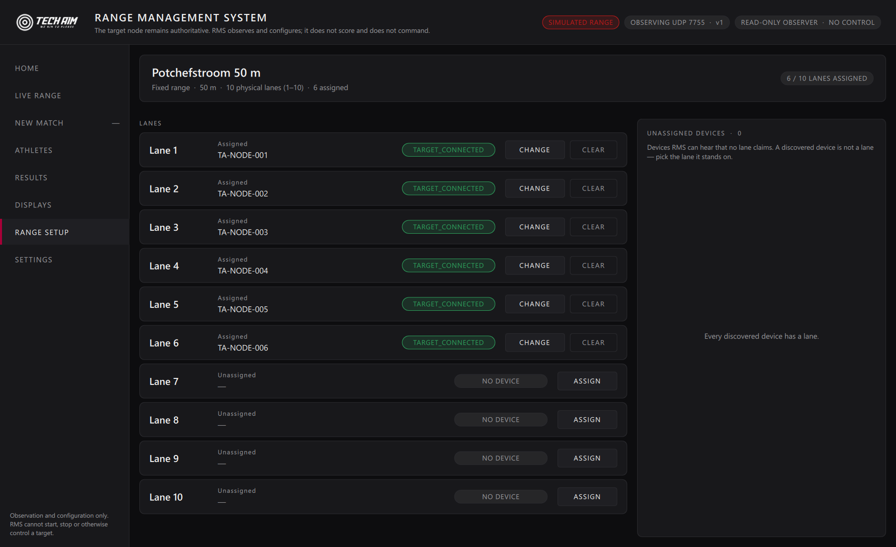
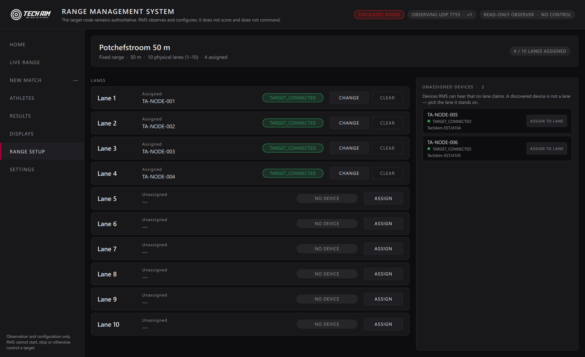
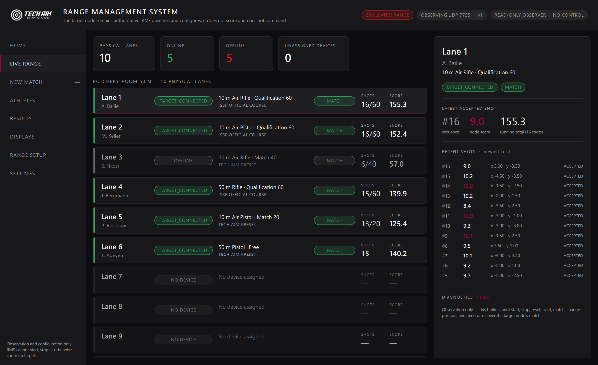
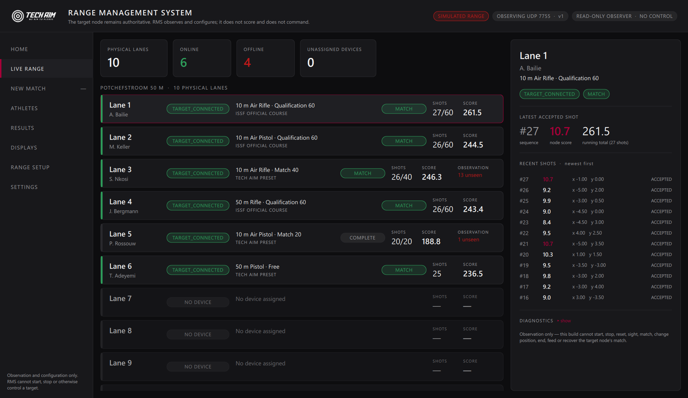
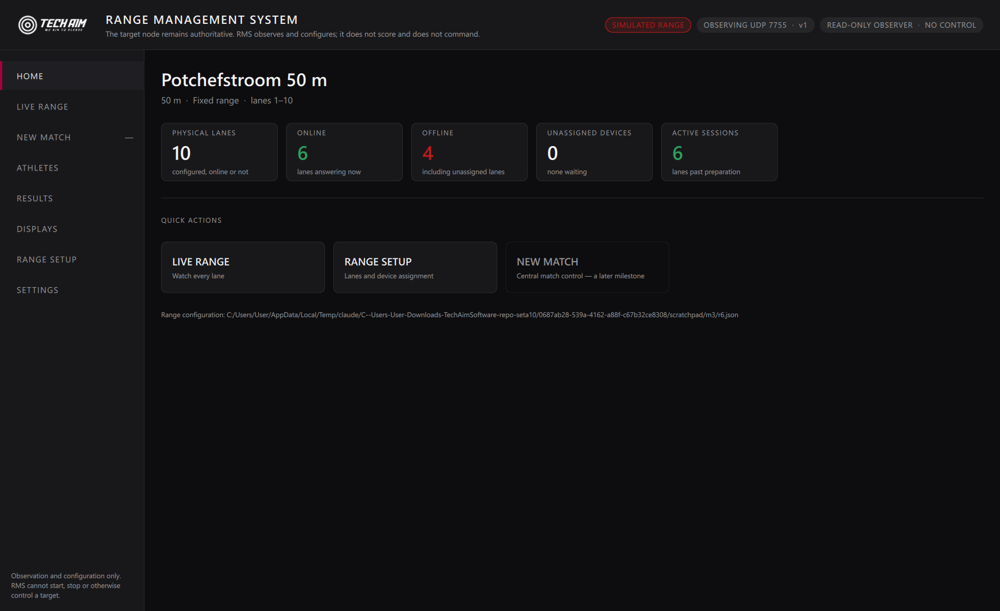
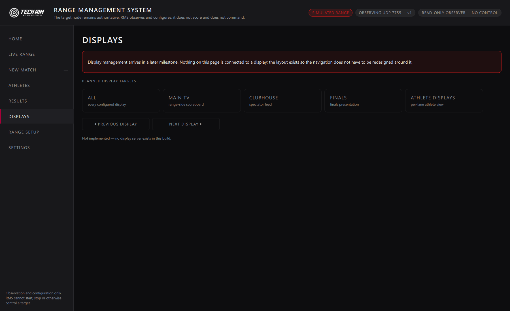

# Tech Aim RMS — milestone 3: range definition and lane configuration

RMS stops being "the nodes I can currently hear" and becomes **a configured
physical shooting range whose stations are discovered and re-attached to their
lanes automatically**.

Branch `feature/rms`. RMS remains observation-and-configuration only: the only
thing it writes is its own range file.

---

## 0. The distinction the whole milestone is built on

**PHYSICAL RANGE DEFINITION** is configuration. **CURRENTLY ONLINE NODES** is
observation. They are different things and RMS now models them separately.

A ten-lane range is a ten-lane range at 06:00 with nothing powered up, and it
is still a ten-lane range when four tablets are flat. Lanes 7 to 10 do not
stop existing because nobody switched them on — they are **OFFLINE**, which is
a different and far more useful thing to tell a range officer than showing
them a six-row list.

The two are joined by **one key**:

```
laneId  ↔  nodeId
```

Not lane ↔ IP, not lane ↔ COM port, not lane ↔ bootId. Every one of those
changes while the station stays the same station, which is exactly why
milestone 2 gave the node a persisted `nodeId` in the first place.

---

## 1 & 2. The model

[`src/rms/RangeDefinition.h`](../../src/rms/RangeDefinition.h)

```
RangeDefinition        rangeId · rangeName · rangeType · mode · lanes[]
                       laneCount / firstLaneNumber / lastLaneNumber derived
LaneDefinition         laneId · laneNumber · displayName · assignedNodeId
                       enabled · notes
RangeMode              FIXED_RANGE | TEMPORARY_RANGE
```

`laneId` is minted once and survives renumbering — an operator who renumbers
lanes 1–10 as 11–20 has not built a new range. `rangeType` is free text
("10 m", "50 m", "10 m + 50 m") and deliberately **not** an enum: a venue's
distances are a property of the venue, and an enum here would become a second
competition catalogue.

**No session state lives in the range definition.** No athlete, no programme,
no score, no phase. Those are observed from telemetry and belong to the node;
putting any of them here would make the range file go stale the moment a match
started.

---

## 3, 13 & 14. Automatic discovery, restart and reconnection

Discovery continues to be milestone 2's `node.announce` / `node.status`. The
join happens on `nodeId`, so **reconnection needs no operator action at all**:

| Situation | Result |
|---|---|
| Station returns on a new IP and a new `bootId` | Same lane. The mapping never referenced either |
| Station's application restarts | Same lane, not a second lane and not a duplicate device |
| Assigned station goes silent | Lane stays visible, assignment stays, status becomes `OFFLINE` |
| It comes back | Lane is live again automatically |

Three lane states are kept distinct rather than collapsed into one, because
they need different responses:

- **NO DEVICE** — the lane exists, nothing is assigned. *A setup task.*
- **OFFLINE** — a station is assigned and is not being heard. *An ops problem.*
- **live** — the station's own reported connection state.

---

## 4. A discovered device is not a lane

New stations land in **UNASSIGNED DEVICES**, never on the range. RMS refuses to
invent a physical firing point from a datagram: a tablet on the bench, a spare
in the office and a station moved to another range would all become phantom
lanes on the range officer's screen. Discovery puts a device in the list; an
operator decides which physical lane — if any — it is standing on.

---

## 5 & 6. Fixed and temporary ranges

**FIXED** is a saved installation. Lanes are created empty; the operator owns
the mapping. This is what a competition range is, and it never auto-builds
itself from whatever happens to be switched on.

**TEMPORARY** builds lanes from the devices discovered right now, in discovered
order, for training, demos and portable installations. The order is a
**starting point, not a claim** about where the stations physically stand, so
the mapping stays fully editable afterwards.

---

## 12. Assignment rules

One node belongs to at most one lane. One lane holds at most one node.

- Assigning to an **occupied** lane is **refused**, and the refusal names the
  station already there. Silently displacing it would be the surprising and
  dangerous behaviour.
- **A move is atomic.** Lane 2 → lane 7 clears lane 2 and sets lane 7 in one
  in-memory edit persisted by one atomic save. A half-applied move would show
  one station on two lanes, and a range officer acting on that is how a shot
  gets credited to the wrong athlete.
- Every refusal is reported. Silent refusal is not an option: the operator must
  know the assignment did not happen.

All of it lives in `RangeConfigurationService`, the single place the
configuration is changed, so there is one implementation of these rules.

---

## 15. Persistence

`<AppLocalDataLocation>/range.json` in **RMS's own namespace** (org "Tech Aim",
application "Tech Aim RMS") — never the target application's AppData. RMS is a
separate product and may run on a machine with no node application installed.

- **Atomic writes** via `QSaveFile`: write-temp-then-rename, so either the
  previous configuration survives intact or the new one lands whole. Losing a
  ten-lane configuration to a power cut mid-save is not acceptable.
- **Versioned** (`schemaVersion`), unknown fields ignored — forward compatible
  in the same way the wire protocol is.
- **A document from a newer RMS is refused, and refusing also blocks saving.**
  Otherwise the older build would show first-run setup, the operator would
  rebuild the range, and the newer version's configuration would be silently
  overwritten. The UI says so instead.

---

## 7–11. The application

Navigation established now so later milestones add pages rather than redesign
the shell: **HOME · LIVE RANGE · NEW MATCH · ATHLETES · RESULTS · DISPLAYS ·
RANGE SETUP · SETTINGS**.

Future pages are not hidden and not faked. They are navigable to a page that
states plainly what is and is not built — except **NEW MATCH**, which is
rendered visibly **disabled** in both the rail and the Home quick actions,
because its name implies control RMS deliberately does not have.

**Engineering detail moved, not deleted.** The lane row now carries what a
range officer acts on: lane, athlete, target status, programme, phase, shots,
score, online/offline. Node ids, boot ids, session ids, ruleset and target
standard, observed-vs-accepted, duplicates, out-of-order arrivals, sequence
gaps, restarts, offline episodes and stale-datagram counters are all still
there — one click away, under **Lane detail → Diagnostics**.

One piece of observation quality stays on the operator's row: **"N unseen"**,
because RMS missing shots the node accepted changes what the officer believes
about the score. That does not belong buried in diagnostics.

---

## 19. The read-only boundary, unchanged

Allowed writes: RMS's own range configuration and lane mappings. **Not
allowed**: any target command — no START, STOP, MATCH, SIGHTING, POSITION
CHANGE, FEED, RESET, PAUSE or RESUME.

Assigning lane 4 to a station tells **RMS** where that station is. It tells the
station nothing. `tst_readonly` remains green: no transmit call, no TCP
connection, no reference to the node's inbound port 7756, no command-shaped
method, and no `Q_INVOKABLE` reachable from QML that acts rather than reports —
with the range configuration service's mutators reviewed against that guard as
configuration writes, not target control.

---

## 16, 17, 20. Deliberately not in this milestone

- **No athlete database.** Athlete names on the Live Range are OBSERVED from
  node telemetry — what the station reports, not an RMS record.
- **No display server.** DISPLAYS is a shell that names its future targets
  (ALL · MAIN TV · CLUBHOUSE · FINALS · ATHLETE DISPLAYS, with previous/next)
  and states that none of it is connected.
- **No commands, in either direction.**

---

## 21. Evidence

Real `grabWindow` captures of `TechAimRMS.exe`. The demonstration range was
built through the **real** `RangeConfigurationService` — the same calls the
Create Range button and the Range Setup assignment controls make — via a
development flag, because a screenshot cannot click.

**A — first run.** No range configured: the operator is asked to describe the
physical range, not dropped into a device monitor.



**B — a ten-lane fixed range with six stations online.** Lanes 7–10 read
`NO DEVICE` and do not disappear. `PHYSICAL LANES 10 · ONLINE 6 · OFFLINE 4`.



**C — Range Setup.** Range definition, lane list and per-lane assignment.



**D — unassigned devices.** Four lanes assigned, two discovered stations
waiting with `ASSIGN TO LANE`, six lanes still empty.



**F — an assigned station goes offline.** Lane 3 reads `OFFLINE`, keeps its
assignment and its last known state, and stays on the range.



**G — and comes back, on the same lane, automatically.** Lane 3 is
`TARGET_CONNECTED` again at 26/40 with **13 unseen** — the shots its node
accepted while RMS could not see it. No operator action; the mapping is by
`nodeId`, which never changed. This is also the Live Range in motion (E).



**H — Home.** Range name, physical lanes, online, offline, unassigned devices,
active sessions, and quick actions with NEW MATCH plainly disabled.



**I — Displays placeholder.**



---

## 22. Next milestone

**ATHLETE + SESSION + PROGRAMME ASSIGNMENT** — an athlete register, and the
assignment of an athlete and a programme to a lane for a session. It will
remain configuration: RMS will record who is on which lane and will still tell
the station nothing.
