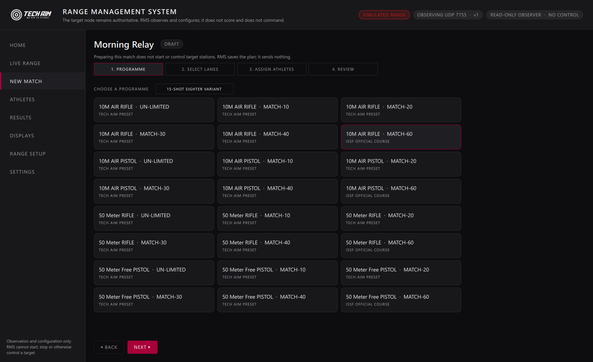
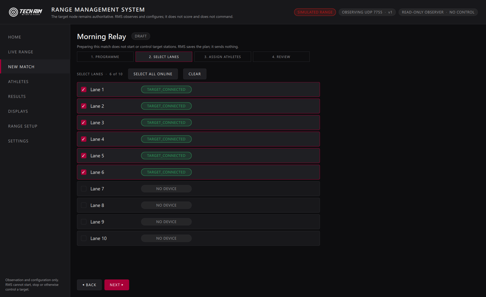
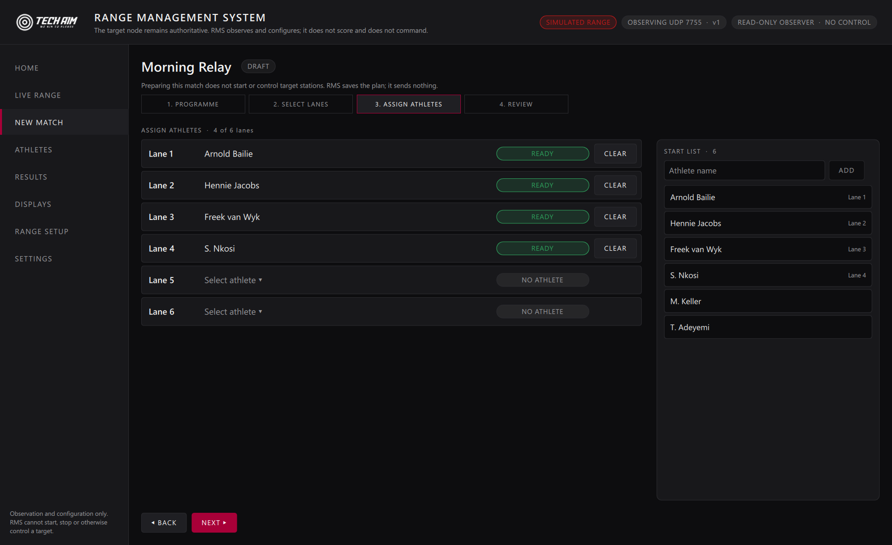
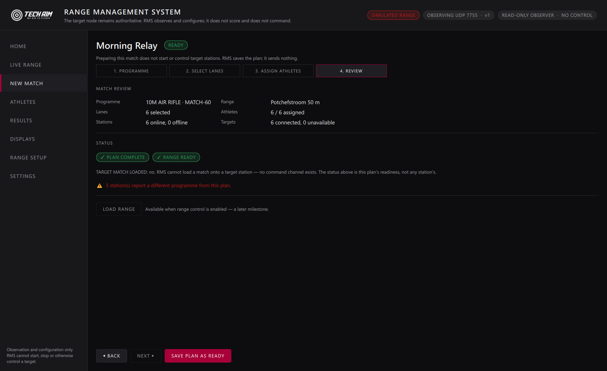
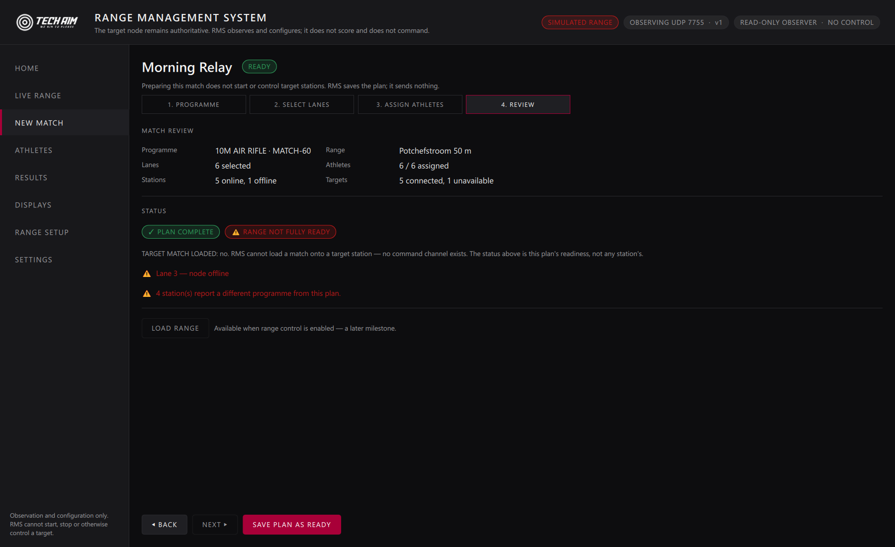
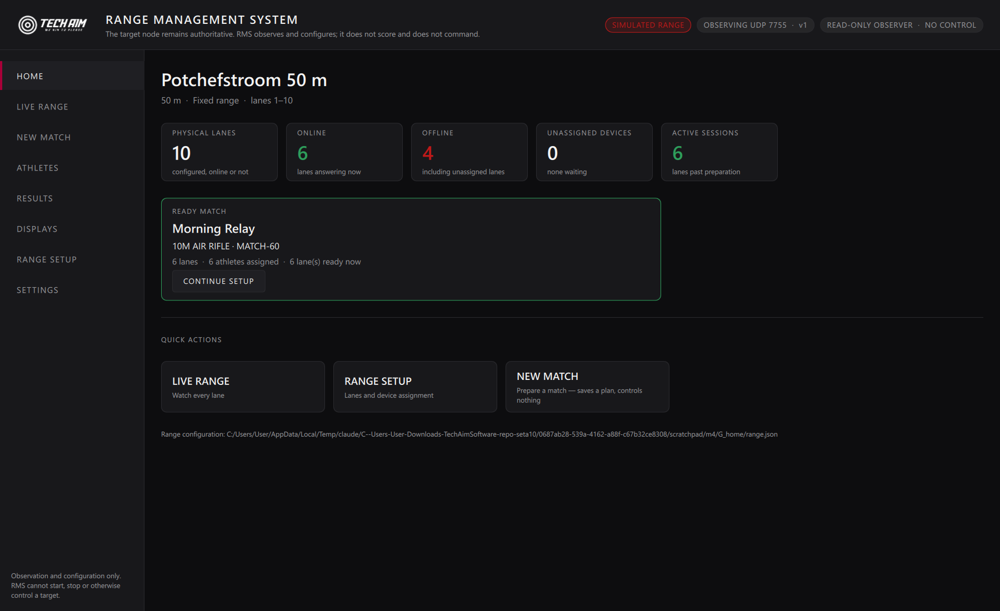
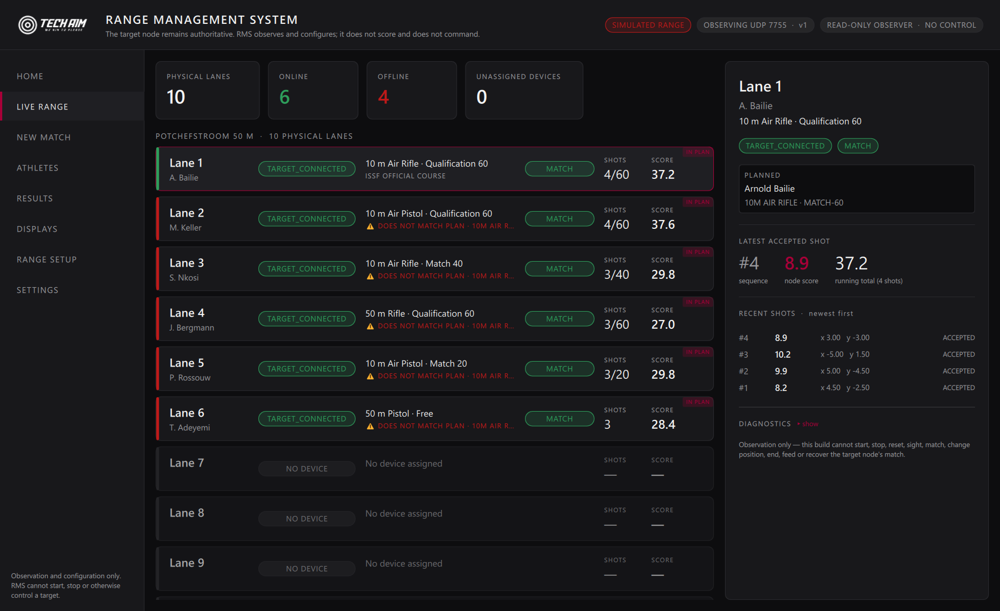
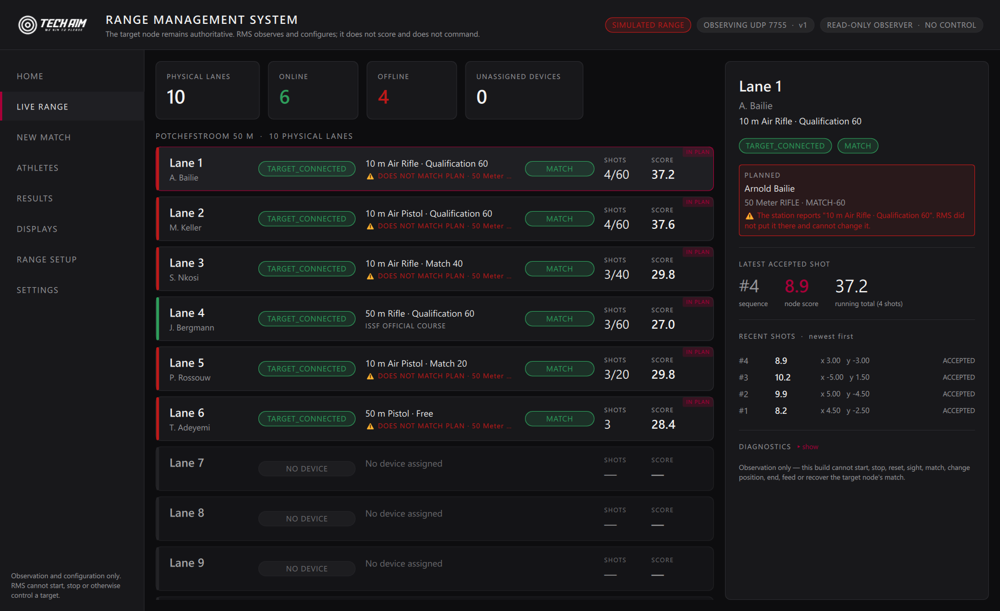
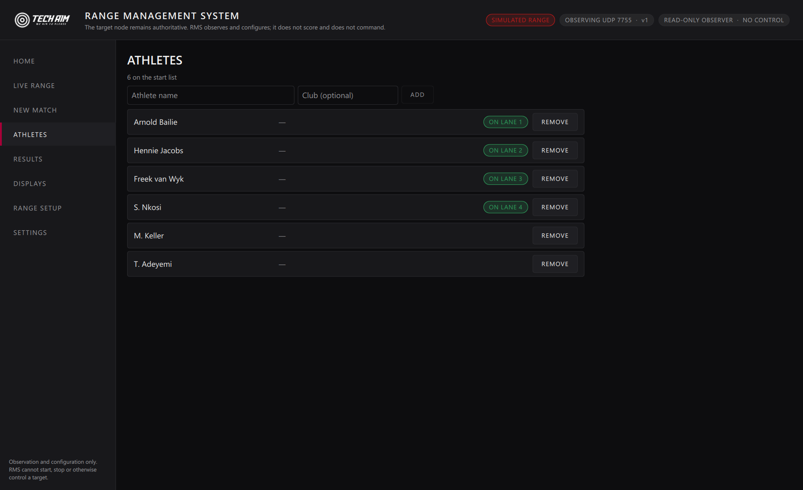

# Tech Aim RMS — milestone 4: athlete, session and programme assignment

The configured physical range becomes a competition **preparation** system: a
programme, the lanes taking part, and who is on them — saved, reopenable, and
reviewable for readiness.

Branch `feature/rms`, from milestone 3 (`922e37d`).

---

## 0. What this milestone does not do

**IT PREPARES; IT DOES NOT COMMAND.** Saving a plan records an intention. No
station is told, asked or configured by any of it, because RMS still has no
command channel. The New Match page says so on every step, and the review
screen says it again in the one place an operator would look for a "go" button.

No competitions are started. No target control was added. Protocol v1 is
unchanged. `tst_readonly` is unchanged and still green.

---

## 1. Three layers, kept apart

```
RangeDefinition     the physical range: lanes, and which station stands on
                    each.                                    CONFIGURATION
        │
        ▼
MatchPlan           a competition being prepared: programme, participating
                    lanes, athletes.                          CONFIGURATION
        │
        ▼
node telemetry      what is actually happening.               OBSERVATION
```

No athlete and no programme was added to `RangeDefinition` or `LaneDefinition`
— those describe the venue, and putting session state in them would make the
range file go stale the moment a match started.

| Type | File |
|---|---|
| `Athlete`, `AthleteRegistry` | [`src/rms/Athlete.h`](../../src/rms/Athlete.h), [`AthleteRegistry.h`](../../src/rms/AthleteRegistry.h) |
| `MatchPlan`, `PlanLane`, `ProgrammeSnapshot` | [`src/rms/MatchPlan.h`](../../src/rms/MatchPlan.h) |
| `MatchPlanService` — the only place a plan changes | [`src/rms/MatchPlanService.h`](../../src/rms/MatchPlanService.h) |
| `PlanLaneModel`, `AthleteListModel` | view models for the wizard |
| `RmsJsonStore` | one implementation of versioned, atomic RMS document I/O |

---

## 2. planId is not a node sessionId

A node's `sessionId` identifies one match on one station. A plan spans several
stations and will, once commands exist, enclose several node sessions.
Conflating them now would make that binding impossible later, so they are
separate fields and a test asserts they differ.

Plan states are **DRAFT**, **READY** and **ARCHIVED**. There is deliberately no
`RUNNING`: running would mean RMS had told the stations something.

---

## 3. Programme selection

`CompetitionCatalogue.qml` is reused **unmodified** and is the only programme
list on this branch. RMS keeps no second catalogue. The picker reads
`entriesFor(...)`, with a toggle for the 15-shot sighter variants, and passes
**IDs** to the service; the label travels only as a snapshot for historical
display and never drives a decision (QML-LANG-001).

No DSB entries were fabricated. The catalogue on this branch is Tech Aim and
ISSF; a federation catalogue arrives when it is deliberately promoted.

The plan snapshots `programmeId · rulesetId · targetStandardId · disciplineId ·
distanceM · shotCount · programmeType · displayLabel`. **No scoring formula and
no target geometry is copied into RMS** — those stay in the target application.

---

## 4. Athletes

A small start list: `athleteId · displayName · club · country · notes ·
temporary`. Not a federation database — licences, classifications and
eligibility are federation concerns, and an RMS-local version of any of them
would be a second source of truth no federation recognises.

- **Quick field-test entry**: a name and one press, usable immediately. If a
  lane is waiting, the new athlete goes straight onto it.
- **Duplicate display names are allowed** — two people may share a name, and an
  assignment refers to the `athleteId`.
- **An athlete on a plan lane cannot be deleted.** The refusal names the match
  to clear first; a lane pointing at somebody who no longer exists is worse.

---

## 5. Assignment rules

Within one plan: **one athlete, one lane**. Somebody cannot shoot lane 1 and
lane 4 in the same match, and a plan that said they could would have a range
officer looking for a person who is not there. The refusal names the lane they
are already on.

Moving is clear-then-assign — explicit, never implicit.

---

## 6. Lane selection

Every physical lane is offered, online or not. **Offline lanes may be selected
deliberately** — a tablet may be switched on minutes before the start — but
never quietly: the row carries a warning that it is selected and not answering
yet, and the review lists it. `SELECT ALL ONLINE` picks up only the lanes
answering now.

---

## 7. Readiness: two questions, and one RMS must not answer

| | |
|---|---|
| **PLAN COMPLETE** | did the operator fill it in? Programme chosen, lanes selected, every lane has an athlete |
| **RANGE READY** | is every participating lane answering with a connected target? |
| **TARGET MATCH LOADED** | **always false.** RMS cannot load a match onto a station — no command channel exists |

Per-lane readiness distinguishes `NO DEVICE`, `NODE OFFLINE`,
`TARGET DISCONNECTED` and `NO ATHLETE`, because they need different responses:
the first is a setup task, the middle two are ops problems, the last is the
operator's own remaining work.

Marking a plan **READY** requires the plan to be complete. It deliberately does
**not** require the stations to be healthy: refusing to save a finished plan
because a tablet is off would be unhelpful, and range health is reported
separately on the same screen.

---

## 8. Planned vs observed

Compared **by stable id**, never by label:

| Node reports | Result |
|---|---|
| the planned `programmeId` | `MATCHES PLAN` |
| a different `programmeId` | `DOES NOT MATCH PLAN` — reported, never resolved |
| nothing (silent) | `OFFLINE` |
| no programme set yet | `UNKNOWN` |

RMS did not put that programme on the station and cannot change it, so the plan
is not silently adopted and the station is not silently overwritten. The
Live Range shows both side by side and marks the disagreement; a test asserts
that after a mismatch **both** the plan and the station are unchanged.

This becomes load-bearing the moment commands exist — see
[the command boundary note](rms-command-boundary-design.md).

---

## 9. Persistence

`athletes.json` and `plans.json` beside `range.json` in **RMS's own namespace**.
Versioned, unknown fields ignored, atomic write-then-rename, and a document
from a newer RMS is refused **and** blocks saving.

**ONLINE/OFFLINE is never persisted.** A stored "ready" would be a claim about
the world that stopped being true the moment RMS was closed, so readiness is
recomputed from live telemetry after every restart. A test asserts that a
freshly started RMS restores the plan intact and reports the range as *not*
ready until it hears something.

---

## 10. Evidence

Real `grabWindow` captures of `TechAimRMS.exe`. Every control shown is
genuinely wired and clickable; a development flag drives the same service
methods the buttons call, because a screenshot cannot click.

**A — programme.** The catalogue, with official courses and Tech Aim presets
distinguished.



**B — select lanes.** Every physical lane, with SELECT ALL ONLINE.



**C — assign athletes**, and the quick-create field that makes a new athlete
usable on the spot. Four lanes assigned and ready, two still `NO ATHLETE`; the
start list shows which lane each athlete is on.



**E — review, all ready.** PLAN COMPLETE and RANGE READY.



**F — review, one station offline.** PLAN COMPLETE with RANGE NOT FULLY READY,
the offending lane named, the programme mismatch counted, LOAD RANGE disabled
and labelled, and the "TARGET MATCH LOADED: no" disclaimer.



**G — Home**, with the plan card and CONTINUE SETUP.



**H — Live Range with the plan.** Lane 1 agrees with the plan; the detail pane
shows `PLANNED  Arnold Bailie / 10M AIR RIFLE · MATCH-60` beside the observed
values.



**I — planned-vs-observed mismatch.** The plan is the 50 m course; five
stations are set to something else and say so, while lane 4 — genuinely on
50 m Rifle Qualification 60 — agrees.



**J — Athletes.**



---

## 11. Design notes written, not built

- [Incident model](rms-incident-model-design.md) — the raw observed shot and the
  adjudicated result are two different things, and the raw one is never
  destroyed.
- [Command boundary](rms-command-boundary-design.md) — how a plan will one day
  reach the stations, and why legacy UDP 7756 stays outside RMS.

## 12. Next milestone

**TARGET DISPLAY MVP** — all targets, single target, previous/next, full
screen, rotating lanes. The lane detail already exposes everything such a view
needs: lane, planned and observed athlete, programme, score, shot count, recent
accepted shots with x/y, and connection status. **RMS will render; it will
still not compute a score.**
