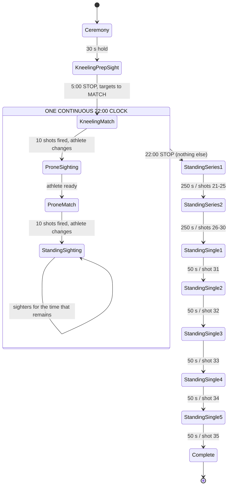

# 50 m Rifle 3 Positions Final — authoritative state flow (ISSF 2026)

> ## ⚠ THIS FILE DESCRIBES COMPETITION LOGIC.
> ## DO NOT MODIFY THE STATE MACHINE WITHOUT CHECKING THE CURRENT ISSF RULE.
>
> A change here is a change to what the athlete is scored on. If the rule and
> this file disagree, the rule wins and this file is corrected — never the
> reverse. If the rule is unavailable, **stop and ask**; do not infer it from
> the code, and do not infer it from an older format.

## Source

| | |
|---|---|
| Rulebook | ISSF Rule Book 2026 |
| Edition | Edition 2025 |
| Print | **Second Print 07/2026** — verified from the ISSF PDF |
| Effective | **1 July 2026** |
| Rule | **6.17.3 — FINALS 50 m RIFLE 3-POSITION MEN AND WOMEN** |
| Course | **35 official shots** |

**Status of every rule statement below: ✅ Official ISSF rule verified.**
Rule 6.17.3 was read section by section (a–k) from the official PDF on
2026-08-27 — see [ISSF-50M-3P-FINAL-SOURCE-MANIFEST.md](ISSF-50M-3P-FINAL-SOURCE-MANIFEST.md)
for the URL, retrieval method and the verbatim command phrases captured.

### Print discrepancy — RESOLVED

An earlier revision of this file cited *First Print 12/2025, effective
1 January 2026*. The current print is the **Second Print 07/2026, effective
1 July 2026**, and it is now the authority. The two prints give an **identical**
3P Final flow — every duration, shot count, command phrase and elimination
point is the same, compared line by line in
[ISSF-50M-3P-FINAL-CURRENT-RULE-DECISION.md](ISSF-50M-3P-FINAL-CURRENT-RULE-DECISION.md).
No implementation change was required by the correction.

### Explicitly NOT the rule

The following belong to the **previous** format and must never appear in this
software:

- 45-shot Final, or 15 + 15 + 15 position blocks
- a 7-minute Kneeling → Prone changeover
- a 9-minute Prone → Standing changeover
- any preparation or sighting period after the 22-minute block

---

## Course — 35 official shots

| Block | Position | Official shots |
|---|---|---|
| Kneeling match | KNEELING | **1–10** |
| Prone match | PRONE | **11–20** |
| Standing Series 1 | STANDING | **21–25** |
| Standing Series 2 | STANDING | **26–30** |
| Standing singles | STANDING | **31, 32, 33, 34, 35** |

`10 + 10 + 15 = 35`. **No other match-shot block exists.** Sighting shots are
never official and never enter any total.

---

## The 22-minute block — the part that matters most

After the single 5:00 Kneeling preparation-and-sighting period ends and targets
are reset to MATCH, the CRO starts **one continuous 22:00 countdown**.

Everything below happens **inside that same clock**:

1. fire 10 KNEELING match shots
2. insert safety flag
3. change to PRONE
4. target MATCH → SIGHTING
5. unlimited PRONE sighting shots
6. target SIGHTING → MATCH
7. fire 10 PRONE match shots
8. insert safety flag
9. change to STANDING
10. target → SIGHTING
11. unlimited STANDING sighting shots **in whatever time remains**

Warnings on that clock: **FIVE MINUTES** at 17:00 elapsed, **THIRTY SECONDS**
at 21:30 elapsed, **STOP** at 22:00.

### Finishing early does not end the block

If the athlete finishes Kneeling and Prone with, say, 6:20 remaining, then
6:20 of Standing sighting remains available. **The 22-minute clock continues.**
The software must not skip forward because the match shots are done.

### Shot counts do not control the clock

Shots decide **what the athlete may do next**; time decides **when the block
ends**. Kneeling reaching 10 permits the change to Prone. Prone reaching 10
permits the change to Standing. Neither ends the 22 minutes.

### No compensation time

Slow position changes, slow sighting or slow preparation are the athlete's own
pacing. The software must not add a second sighting timer to compensate.
Extra time is added only where an ISSF malfunction / authorised-extra-time rule
requires it. ⏳ *(the 3P-Final-specific malfunction allowance remains awaiting
an official rule — see [est-malfunctions.md](../issf-rules/est-malfunctions.md))*

---

## State table

`TARGET` is the target mode the athlete/lane must be in. `OFFICIAL` is the
official shot range that state can produce.

| STATE | POSITION | TARGET | OFFICIAL | TIMER | CRO DISPLAY | ALLOWED | EXIT | NEXT |
|---|---|---|---|---|---|---|---|---|
| `Ceremony` | KNEELING | SIGHTING | — | 20 s intro + 30 s hold | `ATHLETES TO THE LINE` · `INTRODUCING — <name>` · `TAKE YOUR POSITIONS` | take position | hold expires | `KneelingPrepSight` |
| `KneelingPrepSight` | KNEELING | SIGHTING | — | **5:00** | `PREPARATION AND SIGHTING TIME STARTS NOW` · `30 SECONDS` at 4:30 · `STOP` | flag out, dry fire, **unlimited kneeling sighters** | 5:00 expires | `KneelingMatch` |
| `KneelingMatch` | KNEELING | MATCH | **1–10** | **22:00 starts** (after 5 s announcement) | `FINALISTS HAVE TWENTY-TWO MINUTES…` then `MATCH FIRING START` | 10 match shots | 10 fired **and** athlete advances | `ProneSighting` |
| `ProneSighting` | PRONE | SIGHTING | — | **shared 22:00** | — | unlimited prone sighters | athlete advances | `ProneMatch` |
| `ProneMatch` | PRONE | MATCH | **11–20** | **shared 22:00** | — | 10 match shots | 10 fired **and** athlete advances | `StandingSighting` |
| `StandingSighting` | STANDING | SIGHTING | — | **shared 22:00** | `FIVE MINUTES` · `THIRTY SECONDS` · `STOP` | unlimited standing sighters | **22:00 expires — nothing else** | `StandingSeries1` |
| `StandingSeries1` | STANDING | MATCH | **21–25** | 30 s gap → `LOAD` → 5 s → **250 s** | `FOR THE NEXT COMPETITION SERIES…LOAD` · `START` · `STOP` | 5 match shots | 5 fired or 250 s expires | `StandingSeries2` |
| `StandingSeries2` | STANDING | MATCH | **26–30** | 15 s gap → `LOAD` → 5 s → **250 s** | as above, then elimination notice | 5 match shots | 5 fired or 250 s expires | `StandingSingle1` |
| `StandingSingle1` | STANDING | MATCH | **31** | 15 s gap → `LOAD` → 5 s → **50 s** | `FOR THE NEXT COMPETITION SHOT…LOAD` · `START` · `STOP` | 1 match shot | shot fired or 50 s | `StandingSingle2` |
| `StandingSingle2` | STANDING | MATCH | **32** | as above | as above | 1 match shot | as above | `StandingSingle3` |
| `StandingSingle3` | STANDING | MATCH | **33** | as above | as above | 1 match shot | as above | `StandingSingle4` |
| `StandingSingle4` | STANDING | MATCH | **34** | as above | as above | 1 match shot | as above | `StandingSingle5` |
| `StandingSingle5` | STANDING | MATCH | **35** | as above | as above | 1 match shot | as above | `Complete` |
| `Complete` | STANDING | closed | — | — | `STOP…UNLOAD` · `RESULTS ARE FINAL` | — | — | — |

**There is exactly one `PreparationSightingStart` in the whole Final.**

---

## Target-mode sequence

```
KneelingPrepSight   SIGHTING
KneelingMatch       MATCH
ProneSighting       SIGHTING      ─┐
ProneMatch          MATCH          │  all inside the
StandingSighting    SIGHTING      ─┘  shared 22:00 clock
StandingSeries1     MATCH
StandingSeries2     MATCH
Singles 31–35       MATCH
```

A SIGHTING shot must never increase `officialShotCount`, a position subtotal
or the Final total.

---

## Elimination checkpoints — structural only

The rule eliminates finalists after Standing Series 2 and after each single:

| After | Rule outcome |
|---|---|
| Series 2 (30 shots) | 8th and 7th eliminated |
| Shot 31 | 6th eliminated |
| Shot 32 | 5th eliminated |
| Shot 33 | 4th eliminated |
| Shot 34 | Bronze decided |
| Shot 35 | Gold and Silver decided |

**This is a single-target application.** It has no knowledge of other lanes, so
it must **not** fabricate a ranking. It shows the structural checkpoint in the
conditional voice the controller already uses — *"8th and 7th places **would
be** eliminated here"* — and official placing requires Range Management
coordination.

## Tie-breaking — RULE KNOWN, DELIBERATELY NOT IMPLEMENTED

Rule 6.17.3 i) is now recorded verbatim in
[ISSF-50M-3P-FINAL-CURRENT-RULE-DECISION.md](ISSF-50M-3P-FINAL-CURRENT-RULE-DECISION.md).
In summary: a tie for the lowest athlete to be eliminated is broken by
additional tie-breaking shot(s); two athletes tied at the end of the second
Standing series are both eliminated and separated by countback (second standing
series, then first standing series, then the highest final shot of the prone
series, etc.); more than two tied means tie-breaking shots.

**Every clause compares athletes across lanes.** A single-target application
has no such knowledge, so Tech Aim implements none of it and must not fabricate
a ranking. Implementing any of it requires Range Management coordination.

---

## Flow diagram



The four states inside the box **share one clock**. Prone and Standing
transitions are *not* independent timing blocks, and no preparation or sighting
period follows the 22:00 STOP.

---

## FINALS3P-FLOW-001 — what this must never become

**The forbidden flow:**

```
22:00 expires  →  another ~5:00 Standing sighting period  →  Standing match
```

**The correct flow:**

```
22:00 expires  →  STOP  →  30 s transition  →  LOAD  →  5 s  →  START (250 s)
```

Enforced by `finals3p_early_kp_completion_must_wait_until_22_min_stop` and the
late-transition cases in `tests/finals/tst_finals3p.cpp`, which assert that
between the 22:00 STOP and Standing Series 1 there is **no** additional
sighting window, and that the whole Final contains exactly one
`PreparationSightingStart`.

---

## Implementation map

| Rule element | Where |
|---|---|
| All durations | `src/finals/Finals3PConfig.h` |
| State machine | `src/finals/Finals3PController.cpp` (`enterStage`, `tick`) |
| Stage enum | `src/finals/Finals3PTypes.h` |
| CRO commands | `Finals3PController::issueCommand` — **the single command source** |
| Operator display | `Finals3PRightPanel.qml`, `FinalsHud.qml` — presentation only |

**QML displays controller state. QML must not decide competition rules.**

Machine-readable companion:
[50M-3P-FINAL-STATE-FLOW-ISSF-2026.json](50M-3P-FINAL-STATE-FLOW-ISSF-2026.json).
This Markdown file is the human-readable authority; the JSON is a portability
convenience and must be regenerated, never diverged.
